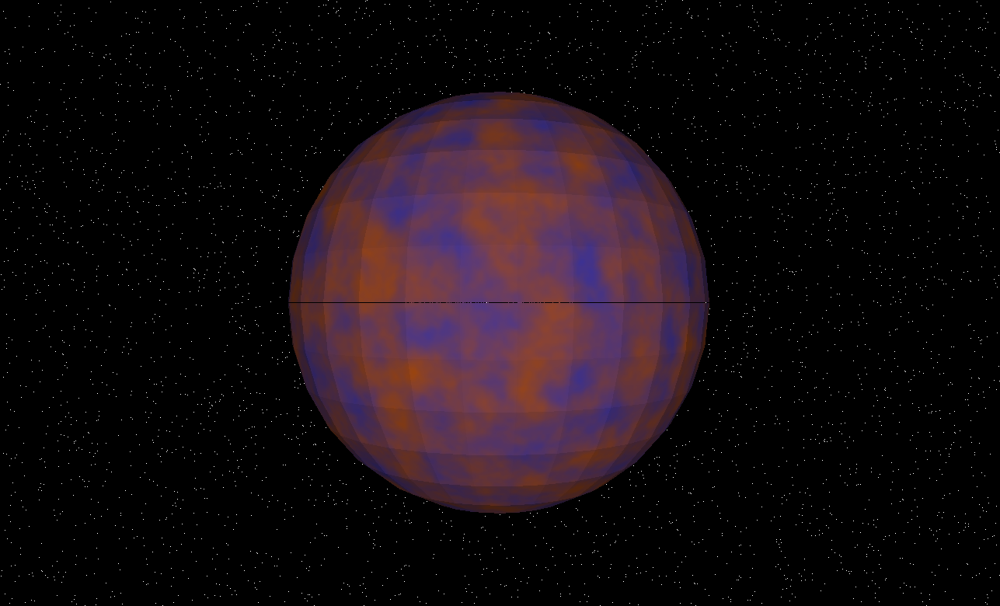

# Lab-4-Shaders

## Descripción
El objetivo de este laboratorio es practicar la creación de shaders interesantes, variando colores y utilizando parámetros disponibles. El desafío consiste en diseñar 3 cuerpos celestes en un software renderer usando exclusivamente shaders: una estrella (como el sol), un planeta rocoso, y un gigante gaseoso.

## Imágenes
| Estrella | Planeta Rocoso | Gigante Gaseoso |
|----------|----------------|-----------------|
|  |  |  |

| Planeta Extra 1 | Planeta Extra 2 | Planeta Extra 3 |
|----------------|----------------|-----------------|
|  |  |  |

## Detalles Importantes
El proyecto utiliza FastNoiseLite para generar ruido en los shaders, lo que permite crear efectos visuales complejos y únicos para cada planeta. Esto es crucial para simular características como atmósferas, superficies rocosas o gaseosas y otros detalles astronómicos.

## Estructura del Proyecto
- `main.cpp`: Contiene la lógica principal de renderizado.
-  ` FastNoiseLite.h`: Libreria para generar ruido en los shaders.
-  `CMakeLists.txt`: Configuración de CMake para compilar el proyecto.
- `Shaders.h`: Define los shaders para los distintos cuerpos celestes.
- `GraphicsHeaders.h` y `FrameBuffer.h`: Proporcionan las estructuras necesarias para el renderizado.
- `ObjLoader.h`: Carga modelos 3D, como esferas, para los planetas.
- `planeta.obj`: Modelo OBJ de una esfera usada para los planetas.
- Imágenes de los planetas: `Gaseoso.png`, `Diamante.png`, `Portal.png`, `Rocoso.png`, `Sol.png`, `Tierra y Luna.png`, `Tormentoso.png`.

## Uso
Para ejecutar el proyecto:
1. Clone el repositorio de GitHub.
2. Compile el código usando CMake y las dependencias necesarias.
3. Ejecute el binario resultante para iniciar la visualización de los planetas.
4. Utilice el mouse o teclado para cambiar entre los diferentes shaders/planetas.

## Puntos Completados
| Criterio                                         | Puntos Posibles | Puntos Completados |
|--------------------------------------------------|-----------------|--------------------|
| Creatividad en el diseño                         | 30              | ?                  |
| Complejidad de los shaders                       | 40              | 40                 |
| Capas del shader que afectan el color            | 10 por capa     | 30                 |
| Planetas adicionales                             | 10 por planeta  | 30                 |
| Sistema de anillos en planetas gaseosos          | 20              | 0                  |
| Implementación de una luna en un planeta rocoso  | 20              | 20                 |

## Autor
- [Javier Ramírez]
